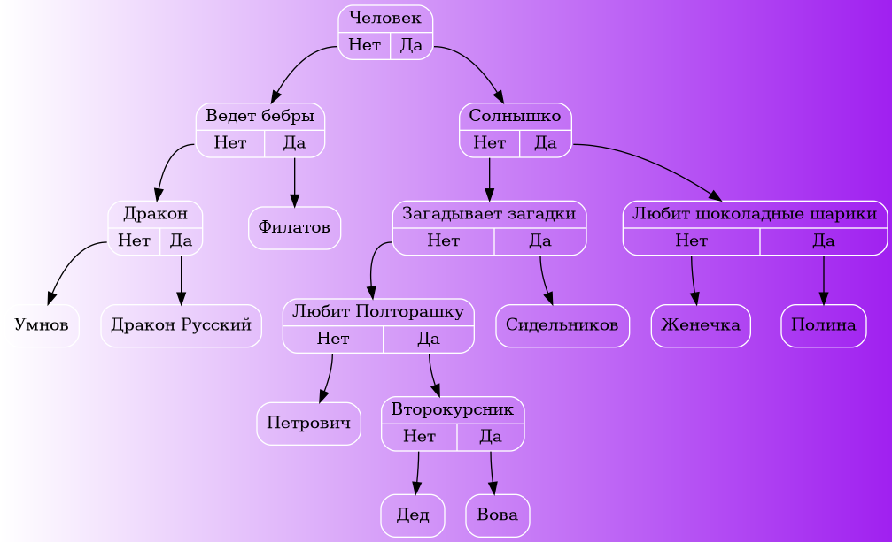

## Акинатор
В этом проекте реализован акинатор, который работает на основе бинарного дерева. Есть функции добавления новых элементов в базу, поиск признаков и сравнение признаков двух элементов.

## Пример дерева 

