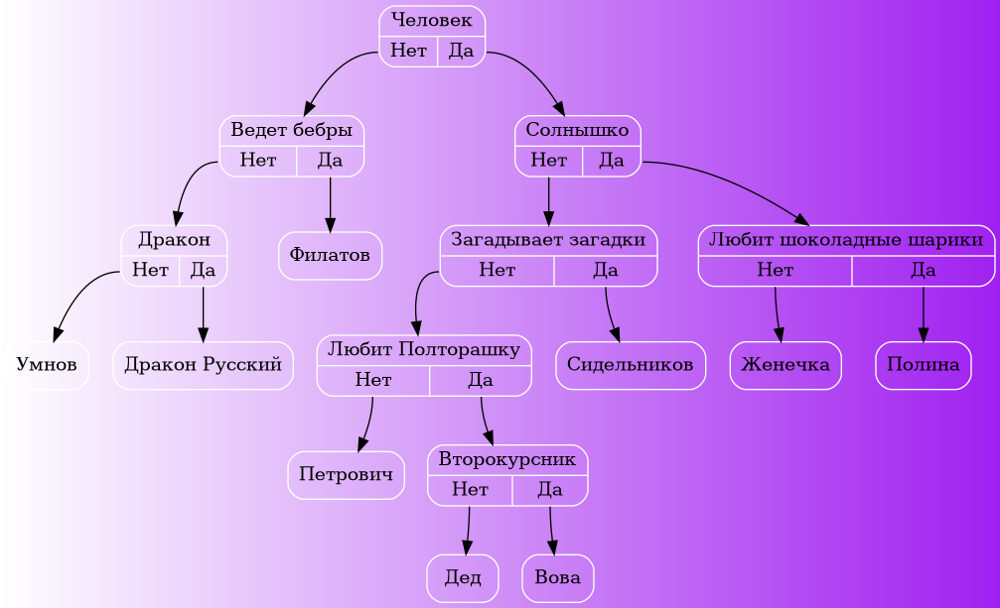

# Akinator

Консольная игра на C++, которая угадывает персонажа с помощью бинарного дерева решений. База знаний умеет пополняться во время игры, а также поддерживает поиск и сравнение признаков объектов.

## Возможности

- угадывание объекта по последовательности вопросов;
- добавление новых объектов и признаков;
- поиск описания объекта и сравнение двух объектов;
- визуализация дерева знаний.

## Запуск

```bash
make
./t
```

## Пример дерева



